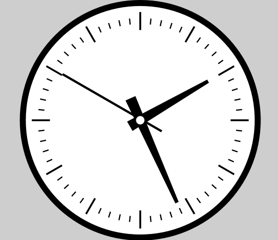

 # AnalogClockDisplay

  A control for rendering a classical clock.

 ## Methods  
__new__ -constructor without parameters  
**bg_color** - returns background color as GtkCustomWidgets::[Color](../Color.md)  
**bg_color=**(color : GtkCustomWidgets::Color) - sets background color.  
**handler_color** - returns handler color as GtkCustomWidgets::[Color](../Color.md)  
**handler_color=**(color : GtkCustomWidgets::Color) - sets handler color.  
**border_color** - returns border color as GtkCustomWidgets::[Color](../Color.md)  
**border_color=**(color : GtkCustomWidgets::Color) - sets border color.  
**border_width** - returns width of border relative to height of display.  
**border_width=**(value : Float64) - sets width of border relative to height of display(mostly from 0.05 to 0.1).   
**hour_line_width** - returns width of line which draw hour scale relative to height of display.  
**hour_line_width=**(value : Float64) - sets width of line which draw hour scale relative to height of display(default value - 0.0075).  
**minute_line_width** - returns width of line which draw minute scale relative to height of display.  
**minute_line_width=**(value : Float64) - sets width of line which draw minute scale relative to height of display(default value - 0.0075).  
**time** - returns time which shows the display.  
**time=**(value : Time) - sets time which shows the display.  

