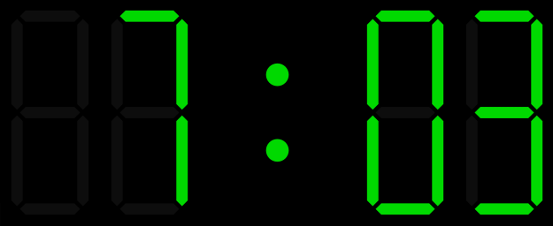

 # DigitalClockDisplay

 A control for rendering a display for digital clock.

 ## Methods  
__new__ -constructor without parameters  
**bg_color** - returns background color as GtkCustomWidgets::[Color](../Color.md)  
**bg_color=**(color : GtkCustomWidgets::Color) - sets background color.  
**on_color** - returns "turn on" color of segments as GtkCustomWidgets::[Color](../Color.md)   
**on_color=**(color : GtkCustomWidgets::Color) - sets "turn on" color of segments.  
**off_color** - returns "turn off" color of segments as GtkCustomWidgets::[Color](../Color.md)   
**off_color=**(color : GtkCustomWidgets::Color) - sets "turn off" color of segments.  
**seg_width** - returns width of segment relative to height of display.  
**seg_width=**(value : Float64) - sets width of segment relative to height of display(mostly from 0.05 to 0.1).   
**blink** - returns *true* if  colon blink, else  returns  *false*.  
**blink=**(value : Bool) - sets mode of colon(if *true* - colon blink).  
**time** - returns time which shows the display.  
**time=**(value : Time) - sets time which shows the display.  

