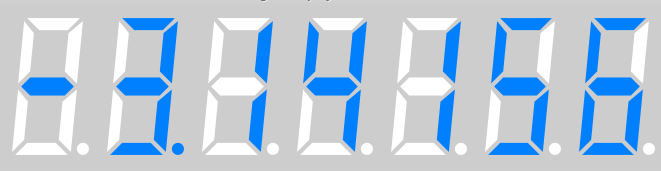

 # DigitalDisplay(T)

 DigitalDisplay(T) is a generic class for rendering control from **n** segment displays of T class.  
 Default number of segment displays - 2.

 ## Methods  
**.new** - constructor without parameters.
**n** - returns number of segment displays.
**n=**(num : Int32) - sets number of segment displays.
**bg_color** - returns background color as GtkCustomWidgets::Color  
**bg_color=**(color : GtkCustomWidgets::Color) - sets background color.  
**on_color** - returns "turn on" color of segments.   
**on_color=**(color : GtkCustomWidgets::Color) - sets "turn on" color of segments.  
**off_color** - returns "turn off" color of segments.   
**off_color=**(color : GtkCustomWidgets::Color) - sets "turn off" color of segments.  
**seg_width** - returns width of segment relative to height of display.  
**seg_width=**(value : Float64) - sets width of segment relative to height of display(mostly from 0.05 to 0.1).   
**print**(text : String) - shows text shows text aligned to left.  
**print**(number : Int) - shows integer number aligned to right.  
**print**(number : Float) - shows float number aligned to right.  

