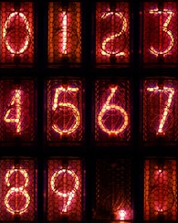

 # NixieTube

 A control for rendering a cold cathode display(nixie tube).(https://en.wikipedia.org/wiki/Nixie_tube)  
 Can be used in [DigitalDisplay](./DigitalDisplay.md)

 ## Metods  
**char** - returns displaying char.  
**char=**(value : Char) - sets displaying char(i.e. '0', '1', '2', '3', '4', '5', '6', '7', '8', '9', '.', ' ')  

