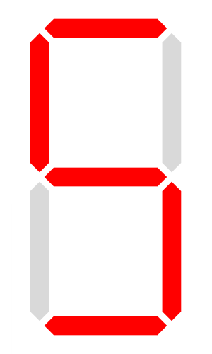

 # SevenSegmentDisplay

 A control for rendering a seven-segment display. (https://en.wikipedia.org/wiki/Seven-segment_display)  
 A base class for other segment displays.

 ## Methods  
__new__ -constructor without parameters  
**bg_color** - returns background color as GtkCustomWidgets::[Color](../Color.md)  
**bg_color=**(color : GtkCustomWidgets::Color) - sets background color.  
**on_color** - returns "turn on" color of segments as GtkCustomWidgets::[Color](../Color.md)   
**on_color=**(color : GtkCustomWidgets::Color) - sets "turn on" color of segments.  
**off_color** - returns "turn off" color of segments as GtkCustomWidgets::[Color](../Color.md)   
**off_color=**(color : GtkCustomWidgets::Color) - sets "turn off" color of segments.  
**seg_width** - returns width of segment relative to height of display.  
**seg_width=**(value : Float64) - sets width of segment relative to height of display(mostly from 0.05 to 0.1).   
**set_seg**(a : Bool = false, b : Bool = false, c : Bool = false, d : Bool = false, e : Bool = false, f : Bool = false, g : Bool = false) - sets segments in "on/off" states.  
**hex=**(value : UInt32) - shows hexidecimal digit (i.e. 0, 1, 2, 3, 4, 5, 6, 7, 8, 9, A, b, C, d, E, F)  
**char=**(value : Char) - shows char (i.e 0,1,2,3,4,5,6,7,8,9,A,b,C,c,d,E,F,G,H,h,I,i,J,L,n,O,o,P,q,r,S,t,U,u,Y,_,-,=,',\u{00B0},[,],' ' )  
**reset** - sets all segments in "turn off" state(i.e. shows " ").  

 

