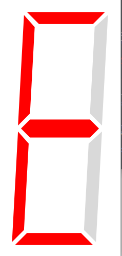

 # SlopSevSegDisplay < SevenSegmentDisplay

 A control for rendering a seven-segment display. (https://en.wikipedia.org/wiki/Seven-segment_display)  
 Differs from [SevenSegmentDisplay](./SevenSegmentDisplay.md) only appearance.  
 

